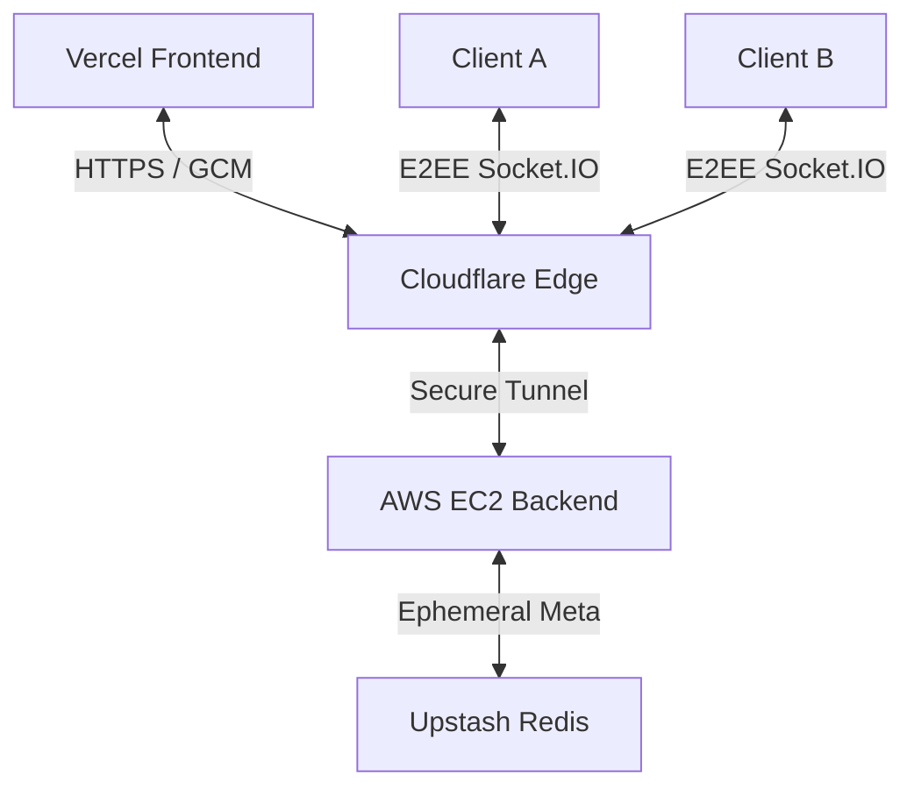

# >Private Chat

A high-performance, ephemeral messaging platform featuring **End-to-End Encryption (E2EE)** and a **Zero-Open-Port** stealth architecture.

## 🛰️ Architecture Preview
The system operates on a hybrid cloud model designed for maximum privacy and infrastructure security.



## Tech Stack
- **Frontend**: Next.js (App Router), Tailwind CSS
- **Real-Time**: Socket.IO (WebSockets)
- **Infrastructure**: AWS EC2 + Cloudflare Tunnels (Named Tunnels)
- **Storage**: Upstash Redis (Ephemeral metadata with auto-TTL)
- **Security**: Web Crypto API (**AES-GCM 256-bit**)

## Core Security Features

### 1. End-to-End Encryption (E2EE)
Messages are encrypted client-side using **AES-GCM**. 
- **Keys**: For secure rooms (`-s`), keys are derived from a PBKDF2 salt and user password. For public rooms (`-p`), keys are derived from the unique Room ID.
- **Privacy**: The server only acts as a relay for encrypted ciphertexts. Encryption keys never leave the browser.

### 2. Stealth Backend (Zero-Open-Ports)
The backend leverages **Cloudflare Tunnels**. 
- **Security**: All inbound ports on the AWS Security Group are closed. 
- **Connectivity**: The EC2 instance establishes an outbound connection to Cloudflare, creating a secure bridge that is invisible to public port scanners.

### 3. Ephemeral "Zero-Memory" Pulse
- **Auto-Destruction**: Upstash Redis TTL ensures all room metadata and states are hard-deleted after 10 minutes.
- **No Persistence**: Conversation history exists only in volatile client-side memory. Refreshing or leaving the room incinerates the session.

## Getting Started

### Prerequisites
- Node.js 20+
- Upstash Redis account
- Cloudflare Account (for Tunneling)

### Environment Setup
Create a `.env.local` for the frontend and `.env` for the backend:
```env
UPSTASH_REDIS_REST_URL=your_upstash_url
UPSTASH_REDIS_REST_TOKEN=your_upstash_token
NEXT_PUBLIC_WS_URL=https://api.yourdomain.com
CLIENT_URL=https://your-app.vercel.app
PORT=8080
```

### Installation
```bash
# Install dependencies
npm install

# Run Frontend
npm run dev

# Run WebSocket Server
npm run ws
```

## Deployment Flow
1. **Frontend**: Deploy to **Vercel**.
2. **Backend**: Host `ws/server.ts` on **AWS EC2** using PM2.
3. **Tunneling**: Install `cloudflared` as a service on EC2 and route a subdomain (e.g., `api.domain.com`) to `localhost:8080`.

---
