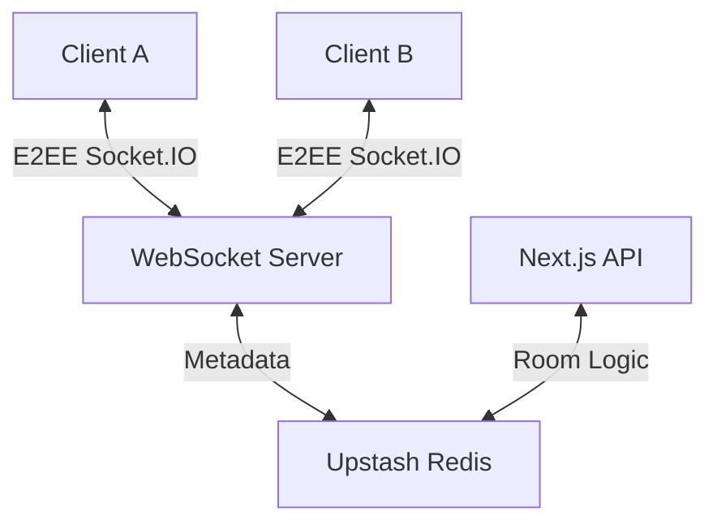

# Private Chat

A high-performance, ephemeral messaging platform featuring End-to-End Encryption (E2EE) and zero-trust architecture.

## Architecture

The system utilizes a client-side encryption model where message content is never accessible to the server in plaintext. All messaging is broadcast in real-time via persistent WebSocket connections.



### Technical Stack
- **Frontend**: Next.js 15 (App Router), Tailwind CSS
- **Real-Time**: Socket.IO
- **Storage**: Upstash Redis (Ephemeral metadata with TTL)
- **Security**: Web Crypto API (AES-GCM 256-bit)

## Core Features

### End-to-End Encryption (E2EE)
Messages are encrypted on the client device using the Web Crypto API. 
- **Public Rooms**: Encryption keys are derived from the unique Room ID.
- **Secure Rooms**: Keys are derived from user-provided passwords using PBKDF2.

### Suffix-Driven State Management
The application utilizes Room ID suffixes (`-s` for secure, `-p` for public) to determine security protocols and UI state without requiring server-side metadata retrieval.

### Ephemerality & Persistence
- **Automatic Expiration**: Redis TTL ensures room metadata is automatically purged after 10 minutes.
- **Manual Destruction**: On-demand purging of room metadata and signaling of socket disconnection for all participants.
- **No Persistence**: Conversation history exists only in client-side memory.

## Getting Started

### Prerequisites
- Node.js 18+
- Upstash Redis account

### Environment Variables
Configure `.env.local`:
```env
UPSTASH_REDIS_REST_URL=your_url
UPSTASH_REDIS_REST_TOKEN=your_token
NEXT_PUBLIC_WS_URL=your_ws_server_url
CLIENT_URL=your_frontend_url
```

### Build & Run
```bash
# Install dependencies
npm install

# Run Frontend (localhost:3000)
npm run dev

# Run WebSocket Server (localhost:8080)
npm run ws
```

## Deployment

### Frontend (Vercel)
Deploy the Next.js application to Vercel and configure all environment variables in the dashboard.

### Backend (Koyeb / Render / EC2)
- Configure the service to run `ws/server.ts` via the `npm run ws` script.
- Ensure the `CLIENT_URL` is configured for CORS to match the Vercel deployment.
